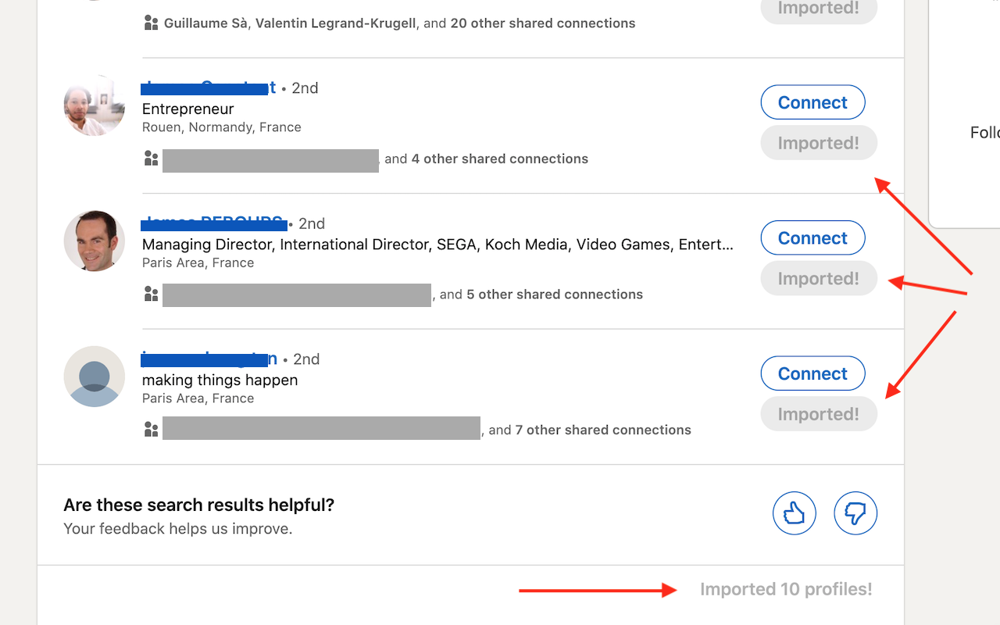

# Chrome Extension - LinkedIn Contact Importer Airtable - Google Sheet - Datablist

This Chrome Extension allows you to import quickly LinkedIn profiles to spreadsheets. It is compatible with Airtable, Google Sheet and Datablist.

Once you have configured your Airtable api key, or connected with your Google account, a "Save Profile" button will be visible on contact profiles and on listing results.

This is the fastest way to build a list of LinkedIn contacts to do data enrichment, leads gathering, competitors employees tracking.

No signup is required other that an Airtable, Google or Datablist account.


The extension is built with the https://github.com/aeksco/react-typescript-web-extension-starter starter kit.




## How to build it

```shell
yarn install
yarn dev
```

In [Google Chrome](https://www.google.com/chrome/), open up chrome://extensions in a new tab. Make sure the `Developer Mode` checkbox in the upper-right corner is turned on. Click `Load unpacked` and select the `dist` directory in this repository - your extension should now be loaded.

**If you don't want to build it. You can download the V1.zip file in the repo releases https://github.com/datablist/linkedin-contact-importer-airtable-google-sheet-datablist/releases/tag/1.0.0 , unzip it and load the folder in Chrome.**


## How to use it

1. Configure a spreadsheet (Airtable, or Google Sheet, or Datablist).


2. If the configuration is ok, a "Save Profile" button will be added to the listing and profile pages.


## Author

Florian Poullin - [Datablist](https://www.datablist.com/)
